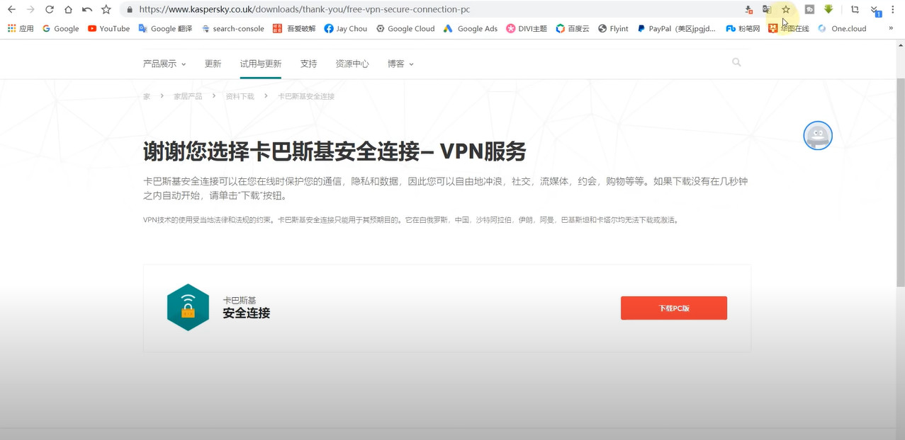
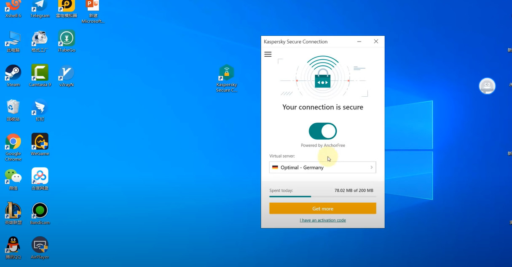
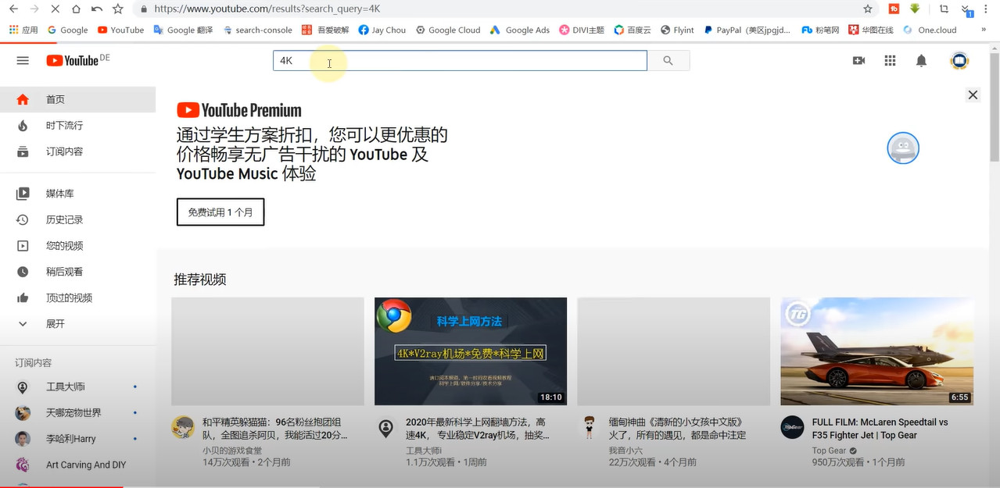
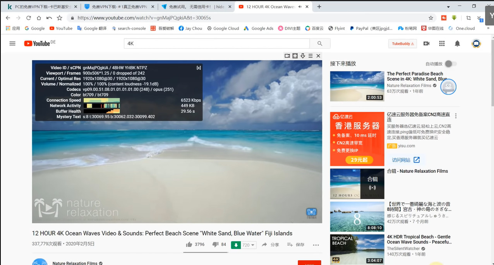
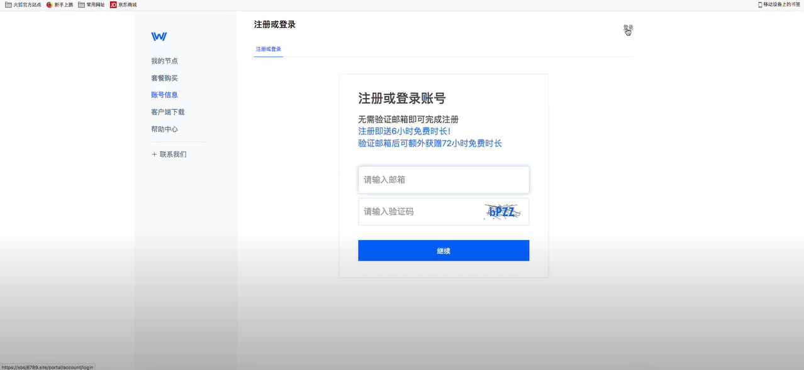
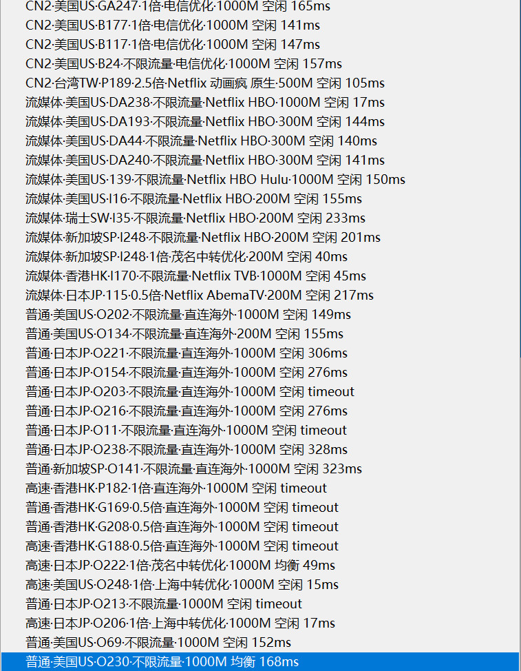
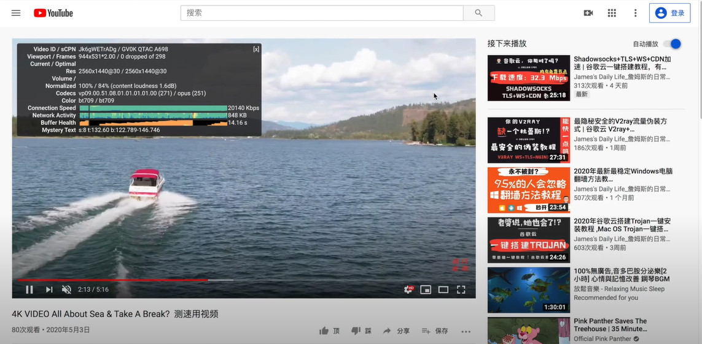
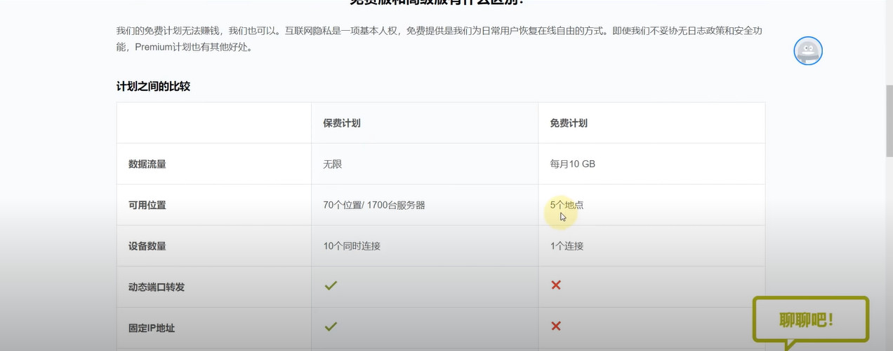
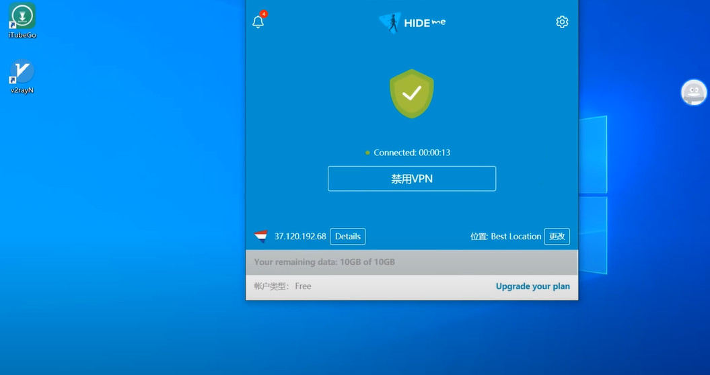
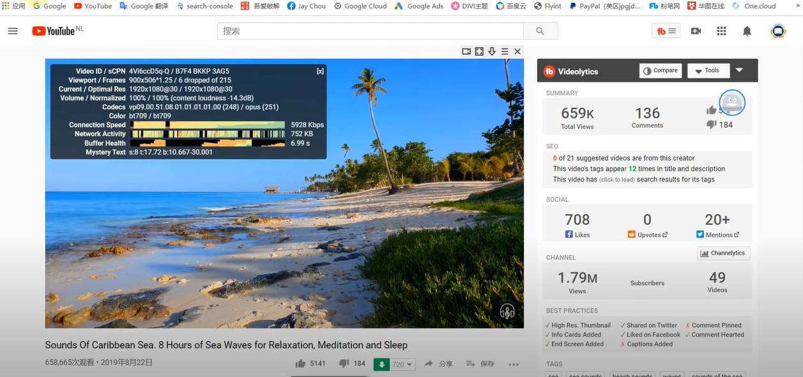

# 知乎推荐全球最好的三款永久免费梯子VPN，帮你解决pc挂梯子如何翻墙上外网的难题，手机电脑梯子推荐，ssr/v2ray/trojan免费节点

## Hello大家好，我是测评老白，今天这期内容是给大家推荐三款世界排名前三的永久免费梯子vpn，可以电脑挂梯子上外网，好用安全且稳定系数高，梯子均采取了军事级的加密。排名方式是根据稳定性，安全性和易用性确定，是我测试了一段时间并且目前正在使用的电脑梯子。

话不多说，接下来咱们直接进入正题。三款电脑梯子都有自己的独特优势，有的包含ssr免费节点，有的梯子是手机电脑可以同时使用，有的是老白测试下来综合各方面评价的特别推荐款，大家看完后可以根据自己情况具体选择，排名不分先后。

### 第一款免费梯子：卡巴斯基电脑梯子VPN
官网地址： [点击访问官网](https://xbsj4621.fun/i/xy080)

卡巴斯基相信大家并不陌生，就是我们经常会遇到的那款杀毒软件，不过很多人不知道卡巴斯基也有自己的VPN，因为我很早之前就用过，目前这是在我备用梯子列表中存在最久的一款梯子。今天也重新拿出来推荐给大家，并且重新测评一下。

卡巴斯基出品的梯子在安全性上是毋庸置疑的，毕竟是专业做杀毒软件的。今天主要是针对易用性和稳定性进行测试。

不过这个梯子有个缺点，就是在白俄罗斯，中国，沙特阿拉伯，伊朗，阿曼，巴基斯坦和卡塔尔等地区是无法下载的，所以大家如果要下载，需要先挂个VPN梯子开全局代理翻墙后下载，建议节点地区选择英国，美国，日本等地。

网址我会在下面贴给大家，大家打开手头的梯子，进入网站后点击橘黄色按钮下载就可以了。

如果大家手头还没梯子，可以暂时先用本页介绍的第二款梯子进行**临时翻墙上外网**，下载卡巴斯基VPN，第二款免费梯子地址：[点击使用翻墙梯子](https://xbsj4621.fun/i/xy080)

卡巴斯基的客户端下载完成后双击图标，他的客户端样式如下：

大家可以看到，这是一个非常简洁的客户端，界面非常干净，中间绿色按钮处是开关，点击之后就能够自动连接。卡巴斯基梯子每天会赠送给用户200M的免费流量，一个月就是6G，如果不是用来看视频仅仅是刷网页的话足够用了，或者可以作为特殊时期的备用梯子这点流量也够用。

连接成功之后我们打开Youtube测试一下速度：

我这是刚打开的瞬间就截图的画面，大家可以看到，加载速度其实还是可以的，并不会说要加载半天才出现预览图的那种，当然跟你们手中的收费机场可能是有点差距，但毕竟是个免费的梯子也不需要要求太多，咱们来试一下4K视频的播放速度：

现在清晰度是1080p，大家可以看到，速度能达到六千多Kbps，作为一个免费梯子来说，速度能得到这个程度，我觉得还是很值得推荐了。老白陆续也试了1440p和2160p，速度跑到了一万多Kbps，也就说看4K是完全没问题的，真的是很令我吃惊。

不过有一点遗憾的是给的流量有点少了，我测试了视频没一会儿就把200M赠送流量全部用完，要继续使用只能等明天。

但是话又说回来，作为卡巴斯基出品的这么安全的一个免费梯子，不收费给顾客使用，虽然流量有点少，但这也是一款不错的产品了。

建议大家使用卡巴斯基的免费VPN的时候采取轻量级使用，上外网查查资料，浏览下网页完全没有问题，如果要看视频流媒体的话，建议大家用下面两款VPN。

### 卡巴斯基VPN下载地址：[点击下载卡巴斯基VPN](https://xbsj4621.fun/i/xy080)

## 第二款免费梯子：西部世界（westworld VPN）

这款梯子不知道大家有没有听过，相信可能很多人有听过，在很多人眼里西部世界是个收费机场，但是老白今天教大家怎么白嫖这个西部世界VPN，让他成为一个免费ssr/v2ray/trojan节点机场供大家使用。

这个梯子的优势就是速度快，免费节点有着付费节点的使用速度，而且不限流量，用来刷视频最合适。

### 西部世界（westworld梯子）官网地址：[https://xuebi0702.com](https://xuebi0702.com)

西部世界这个机场老白自己是开通了年费的，也是目前我正在使用的主力机场，但是在付费之前，老白也白嫖了他们大半年的免费节点，后来是要看Netflix才不得不开通他们的付费节点权限，因为免费节点并不支持Netflix，不过用他看看Youtube的视频体验还是很不错的。

西部世界这款梯子是承诺永不跑路的，不过因为我们是白嫖，所以这点就可以不管他，白嫖的关键点在注册这一步，因为他们是支持邮箱注册，这个邮箱可以填写自己的真实邮箱，也可以随意填写，区别就是随意填写的邮箱因为不能接收到验证码所以只赠送六小时的免费时间，真实有限可以接收验证码验证后能赠送三天免费时长。

填写真实邮箱后续会收到他们一些优惠活动的通知邮件，应该也是他们的推广需要。

打开westworld梯子的注册主页，填写邮箱进行注册如下图：

在这里的注册邮箱填写这块儿，可以直接去google或百度搜索关键词‘临时邮箱’，有大量的临时邮箱网站能够提供接收验证码服务，用他们的邮箱验证后就能得到三天的免费试用时长，等时长用完再换个临时邮箱注册就可以了，注册只需十几秒时间，能够换来三天白嫖，老白当初就是靠这个方法用了大半年**免费的西部世界**，如果不是后来要看Netflix，估计还会继续免费的用下去。

因为本期介绍的是免费梯子，所以在这里就不过多介绍他们的付费节点速度有多快了，总之感觉物超所值，今天这里只针对免费节点速度测评。

老白电脑上选用的外网节点是普通.美国.不限流量节点，这条节点是免费用户也可以用的：

测速依旧选用Youtube平台：

可以看到，西部世界免费节点看视频的速度能轻松跑到两万多的Kbps，明显比卡巴斯基的要快很多，而且这只是免费节点的速度。

如果大家可以接受三天注册一次账号（在老白看来这并不需要花费额外精力）或者干脆直接付费的话，可以直接用这款梯子： https://xbsj4621.fun/i/xy08

## 第三款免费梯子：Push-me VPN
### Push-me官网地址: [点击访问官网](https://xuebispeed.com/)
这款免费梯子也是我现在测试过的，速度还算不错，虽然略逊色于上面两款，但毕竟是免费的，Hide-me给免费用户提供每月10G的流量，和五个地区的节点，并且只能单客户端连接。

Push-me有强大的安全协议，没有后门，和上面两款一样不保留用户日志，接下来我们直接进行实测看下速度如何。

之所以把Push-me放在第三位，是因为他的客户端弹窗时不时会自动启动，这种弹窗并不是广告，而是他自己客户端的弹窗，这一点用起来让我有些不舒服，而且有时候打开客户端加载会比较慢。

打开Push-me的客户端后，点击中间按钮就能连接上VPN线路，目前我这个是打开状态，稳定性来说老白觉得没有前两款好，就是有的时候得连好几次才能连接成功，不过因为是免费的，所以也不用在意太多。

观看速度还是能够达到五千多的Kbps的，这个速度的话看1080p没什么问题，不过因为有前面两款的对比，可能速度显得不是那么的快，但毕竟是免费的梯子，这个速度对于使用来说已经算不错了。

唯一的缺点就是三款VPN的免费节点都不支持Netflix，第二款西部世界的付费节点支持奈飞，但是免费节点不支持。

## 以上就是本期介绍的三款永久免费梯子VPN，第一款和第三款是电脑梯子，第二款是手机和pc端都能使用的梯子，大家如果需要挂梯子上外网，不妨考虑这三款。
